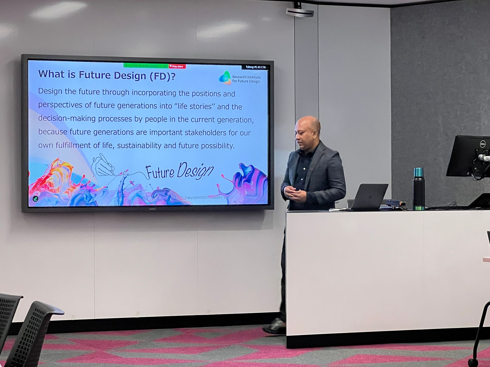
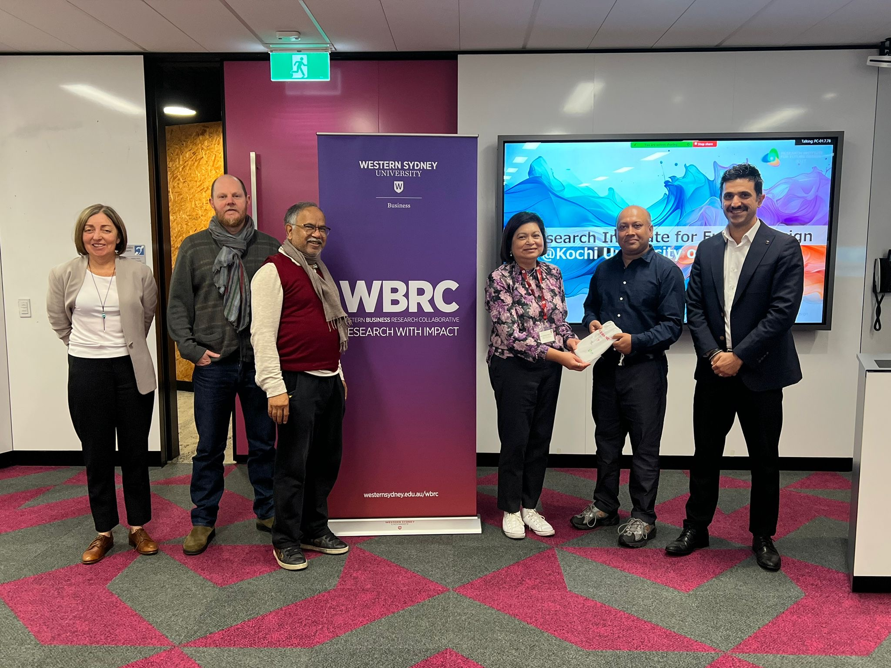
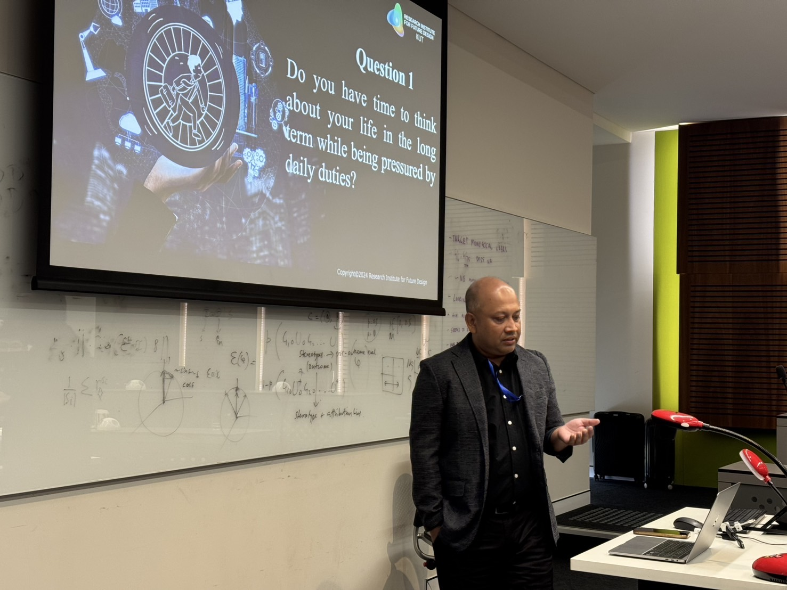
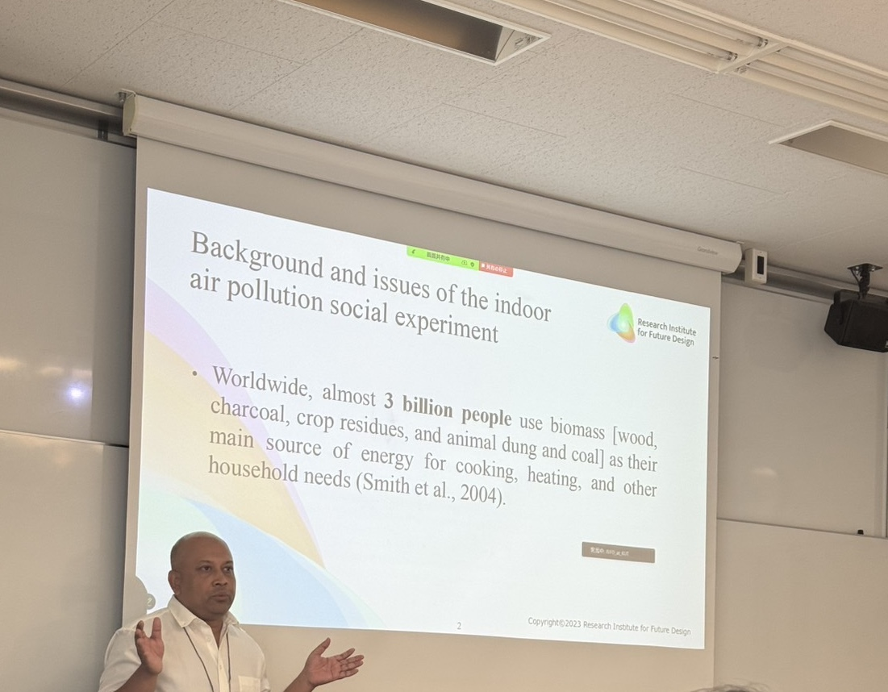

```{r setup, include=FALSE}
knitr::opts_chunk$set(message=FALSE,warning=FALSE, cache=TRUE)
```

#### Research Seminar \| School of Business, University of Western Sydney

-   On 29 August 2025, I have delivered an invited seminar at the School of Business Research Seminar Series 2025, University of Western Sydney, where I have presented my research on sustainability and future design.

```{r, echo=FALSE, out.width="500px", fig.align="center"}

```

```{r, echo=FALSE, out.width="500px", fig.align="center"}

```

#### Australian & New Zealand Workshop in Experimental Economics (ANZWEE) 2025 \| Macquarie University

-   On 30 August 2025, I have presented my paper “Can Future Design Persistently Improve Indoor Air Quality?” at the Australian New Zealand Workshop in Experimental Economics (ANZWEE) 2025, hosted by Macquarie University, Sydney.

```{r, echo=FALSE, out.width="500px", fig.align="center"}

```

#### SEEPS 2025 Conference Presentation \| Musashi University, Tokyo

-   On 21 September 2025, I have presented my research titled "Future Design for Indoor Air Quality in Bangladesh" in the Society for Environmental Economics and Policy Studies (SEEPS) 2025 Annual Conference at Musashi University through a dedicated session on “Future Design and Economic Experiments”.

```{r, echo=FALSE, out.width="500px", fig.align="center"}

```

