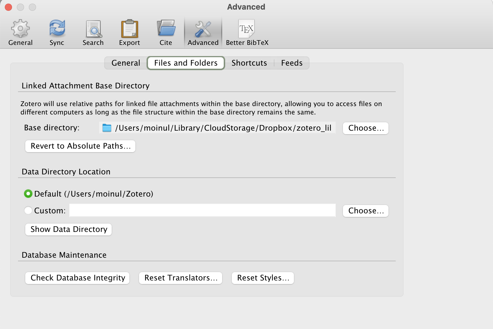
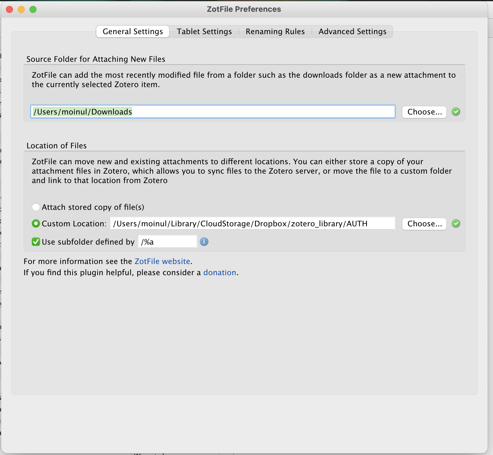
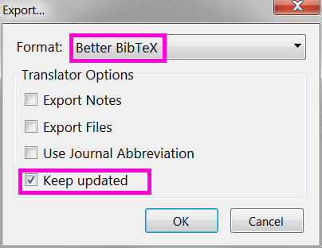

```{r setup, include=FALSE}
knitr::opts_chunk$set(echo = TRUE)
```

# 1. Python

Download [Python](https://www.python.org/)

### A. Deploy oTree application to Heroku server

To upload the oTree application in a cloud server like Heroku is an important step to conduct the online experiments. Here, I am showing the steps that you need to fulfill to upload your application:

1.  Make sure your oTree application is working correctly locally.

2.  Create a Heroku account if you don't already have one.

3.  Install Heroku in your Mac: If you are a Mac user, you can install Heroku application from the **homebrew** as follows:

```{txt}
brew tap heroku/brew && brew install heroku
```

4.  Upload an app in Heroku: To upload your oTree application to Heroku, first create an *application name* inside your Heroku account as below:

New...\> Create New App

5.  Enter to the folder of your Pycharm which contains the application you are interested to upload to Heroku server:

```{txt}
cd appname
```

6.  Proxy settings if necessary Sometime institutional networks (e.g.; universit, office, business) require some additional proxy settings to upload an application to Heroku. I am sharing the example of my institution.

```{txt}
export http_proxy="http://proxy.noc.kochi-tech.ac.jp:3128"
export https_proxy="http://proxy.noc.kochi-tech.ac.jp:3128"
```

7.  Log in to Heroku Now it is time to push your application to your Heroku account. To do so, you need to go through the following steps.

```{txt}
heroku login
git init
git add .
git commit -am "command message"
heroku git:remote -a appname
git push heroku master
heroku config:set OTREE_PRODUCTION=1
```

Your oTree application should now be deployed to your Heroku server. You can access it by going to the URL provided by Heroku.

Note: Sometime due to the inconsistency in version of Python in your computer and reported Python version in runtime.txt might be different. In that case, you might not be able to rung the oTree program in computer. To get rid from it, you can remove the runtime.txt from your Pycharm.

# 2. R

Download [R](https://www.r-project.org/)

Download [RStudio](https://posit.co/download/rstudio-desktop/)

# 3. GNU Emacs

Download [GNU Emacs](https://www.gnu.org/software/emacs/)

# 4. Bibliographic manager

### 4.1 Zotero

Download [Zotero](https://www.zotero.org/)

**Zotero with Quarto and RMarkdown**

1.  Create an account on Zotero website. It will be used later on to sync the database of bibliographic metadata.

2.  Download and install the two plugins we'll need --

{width="400"}

a.  ZotFile (organizes the database of PDFs) and

b.  Better BibTeX (exports the library to .bib, we'll use it later with rmarkdown).

The plugins for Zotero are .xpi archives. To install the plugins open Zotero and click Tools --\> Add-ons. A separate window for Add-ons manager will pop-up.

c.  Select Install Add-on From File option. Finally navigate to the .xpi file and install.

<!-- -->

3.  Zotero preferences. Let's walk though Zotero Preferences. To edit them click Edit --\> Preferences. A window with several tabs pops up.

{width="400"}

4.  Zotero sync. Here we need to specify the account details to sync our database. It is important to uncheck the option of full-text sync otherwise the 300MB storage will quickly get filled. We'll have the solution for full text a bit later.

{width="400"}

5.  Advanced. Here we are most interested in the sub-tab Files and Folders. This is the most important step to separate the storage of metadata and files.

{width="400"}

6.  Better BibTeX. This tab appears after we install the Better BibTeX extension. The extension is needed to export the whole bibliographic library (or some of its parts) as a plain .bib text file. This step is needed to use Zotero in RStudio while writing academic papers with Quarto and RMarkdown.

{width="400"}

7.  The most important option here is to define the rules for creating citation keys. There are almost infinite number of ways one can define these keys (check the manual). My personal choice is [auth:lower][year][journal:lower:abbr], which means that a key consists of the first author's name, publication year, and the first letters abbreviation of the journal's title, everything in lower case.

{width="400"}

8.  ZotFile Preferences. To open the setup window click Tools --\> ZotFile Preferences. Again, the window has several tabs.

General. Here we define two paths.

a.  The first is the default location of the files downloaded by your browser. This option tells ZotFile where to look for the PDFs to process when you import a paper from the publisher's website.

b.  The second path leads to the local directory created for the full-text PDFs, the one that I named zotero-library and which is synced with an external cloud solution of our choice.

{width="400"}

9.  Renaming Rules. Here it's important to make sure that ZotFile is responsible for renaming. Then we define how to rename the PDFs based on the bibliographic metadata available. Again, here we have many many options. My choice is {%a\_}{%y\_}{%t} which yields file names like.

If you parse the metadata manually from a PDF, make sure to rename the file using ZotFile. For that right-click the metadata record Manage Attachments --\> Rename Attachments. This action explicitly tells to use ZotFile for renaming and will move the renamed PDF to a proper sub-directory.

{width="400"}

10. Use Zotero library in RStudio with rmarkdown

Better BibTeX offers an easy way to export bibliographic records from Zotero as plain .bib text and keep the file updated once the records are changed. Just right-click on the collection in Zotero and choose Export Collection.

{width="400"}

{width="400"}

### 4.2 JabRef

Download [JabRef](https://www.jabref.org/)

# 5. Ubuntu and Fedora proxy

### 5.1 Proxy for Ubuntu

```{txt}
@client:~# sudo nano /etc/profile.d/proxy.sh
```

Create new (set proxy settings to the environment variables)

```{txt}
MY_PROXY_URL="proxy.noc.kochi-tech.ac.jp:3128"
```

```{txt}
HTTP_PROXY=$MY_PROXY_URL
HTTPS_PROXY=$MY_PROXY_URL
FTP_PROXY=$MY_PROXY_URL
http_proxy=$MY_PROXY_URL
https_proxy=$MY_PROXY_URL
ftp_proxy=$MY_PROXY_URL
```

```{txt}
export HTTP_PROXY HTTPS_PROXY FTP_PROXY http_proxy https_proxy ftp_proxy
```

```{txt}
@client:~# sudo source /etc/profile.d/proxy.sh
```

It is possible to set proxy settings for each application, not System wide for apt

```{txt}
@client:~# sudo nano /etc/apt/apt.conf
```

Create new

```{txt}
Acquire::http::proxy "http://proxy.noc.kochi-tech.ac.jp:3128";
Acquire::https::proxy "http://proxy.noc.kochi-tech.ac.jp:3128";
Acquire::ftp::proxy "ftp://proxy.noc.kochi-tech.ac.jp:3128";
```

For curl

```{txt}
@client ~]# sudo nano ~/.curlrc
```

Create new

```{txt}
proxy=proxy.noc.kochi-tech.ac.jp:3128
```

For wget

```{txt}
@client:~# sudo nano /etc/wgetrc
```

Add to the end

```{txt}
http_proxy = proxy.noc.kochi-tech.ac.jp:3128
https_proxy = proxy.noc.kochi-tech.ac.jp:3128
ftp_proxy = proxy.noc.kochi-tech.ac.jp:3128
```

### 5.2 Proxy for Fedora

```{txt}
@client:~# sudo nano /etc/profile.d/proxy.sh
```

Create new (set proxy settings to the environment variables for system wide)

```{txt}
MY_PROXY_URL="proxy.noc.kochi-tech.ac.jp:3128"
```

```{txt}
HTTP_PROXY=$MY_PROXY_URL
HTTPS_PROXY=$MY_PROXY_URL
FTP_PROXY=$MY_PROXY_URL
http_proxy=$MY_PROXY_URL
https_proxy=$MY_PROXY_URL
ftp_proxy=$MY_PROXY_URL
```

```{txt}
export HTTP_PROXY HTTPS_PROXY FTP_PROXY http_proxy https_proxy ftp_proxy
```

```{txt}
@client:~# sudo source /etc/profile.d/proxy.sh
```

Or it is possible to set proxy settings for each application, not system wide for dnf

```{txt}
@client:~# sudo nano /etc/dnf/dnf.conf
```

Create new

```{txt}
Acquire::http::proxy "http://proxy.noc.kochi-tech.ac.jp:3128";
Acquire::https::proxy "http://proxy.noc.kochi-tech.ac.jp:3128";
Acquire::ftp::proxy "ftp://proxy.noc.kochi-tech.ac.jp:3128";
```

For curl

```{txt}
@client ~]# sudo nano ~/.curlrc
```

Create new

```{txt}
proxy=proxy.noc.kochi-tech.ac.jp:3128
```

For wget

```{txt}
@client:~# sudo nano /etc/wgetrc
```

Add to the end

```{txt}
http_proxy = proxy.noc.kochi-tech.ac.jp:3128
https_proxy = proxy.noc.kochi-tech.ac.jp:3128
ftp_proxy = proxy.noc.kochi-tech.ac.jp:3128
```
