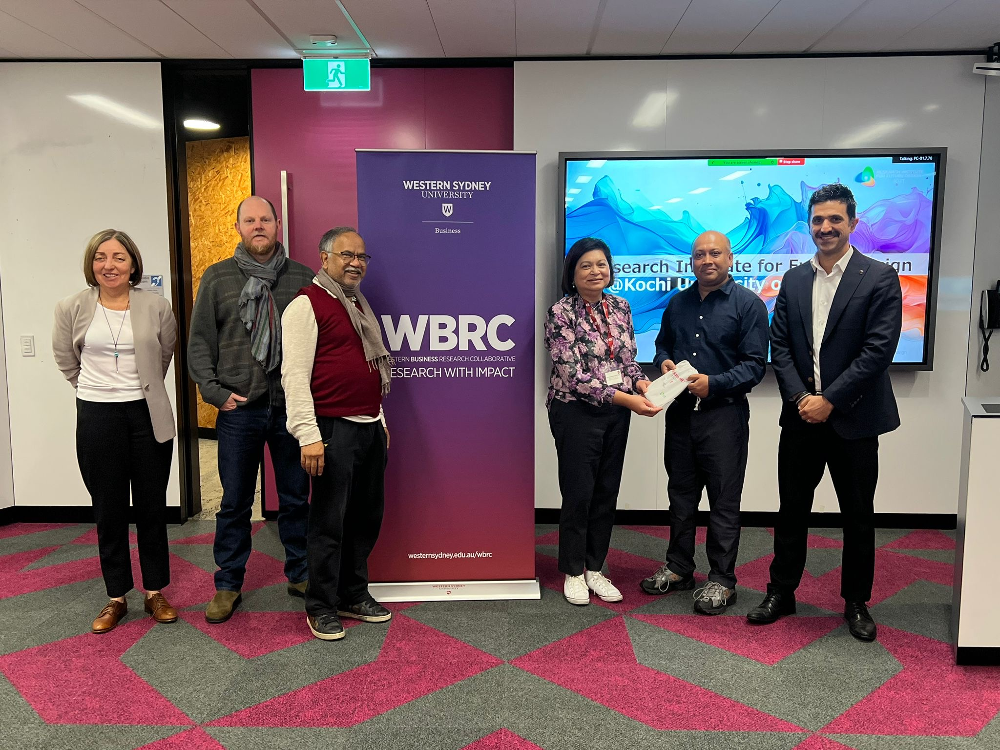
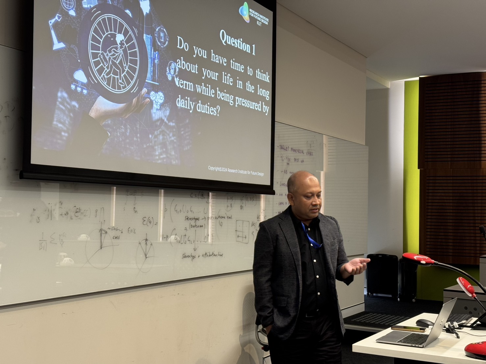
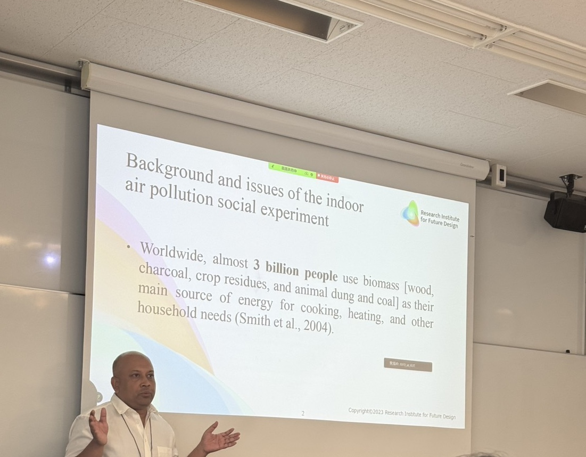

```{r setup, include=FALSE}
knitr::opts_chunk$set(message=FALSE,warning=FALSE, cache=TRUE)
```

#### Research Seminar \| School of Business, University of Western Sydney

**August 29, 2025**: Deliver an invited seminar at the School of Business Research Seminar Series 2025, University of Western Sydney, Australia.

```{r, echo=FALSE, out.width="500px", fig.align="center"}
knitr::include_graphics("img/Western_Sydney_2025_1.JPG")
```

```{r, echo=FALSE, out.width="500px", fig.align="center"}

```

#### Australian & New Zealand Workshop in Experimental Economics (ANZWEE) 2025 \| Macquarie University

**August 30, 2025**: Present my paper “Can future design persistently improve indoor air quality?” at the Australian New Zealand Workshop in Experimental Economics (ANZWEE) 2025, hosted by Macquarie University, Sydney, Australia.

```{r, echo=FALSE, out.width="500px", fig.align="center"}

```

#### SEEPS 2025 Conference Presentation \| Musashi University, Tokyo

**September 21, 2025**: Present my research titled "Can future design persistently improve indoor air quality?" in the Society for Environmental Economics and Policy Studies (SEEPS) 2025 Annual Conference at Musashi University through a dedicated session on “Future Design and Economic Experiments”.

```{r, echo=FALSE, out.width="500px", fig.align="center"}

```

